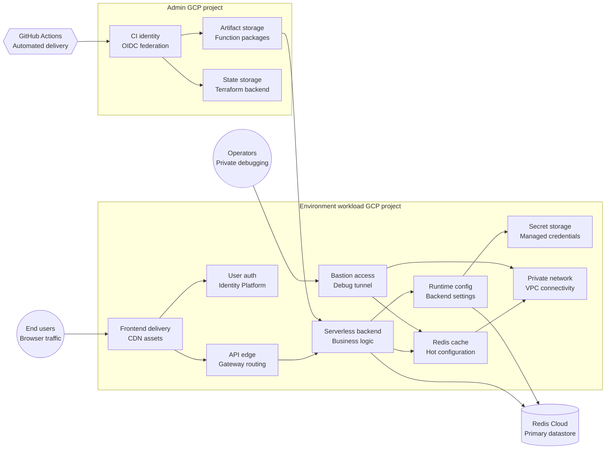

# GCP infrastructure (Terraform)

Contains Terraform templates to provision and bootstrap GCP infrastructure + deploy
`cloudshortener` application on it end-to-end.

## Components



## Terraform layout

There are multiple separate Terraform roots, most of which (except `workload`) provision supporting infrastructure. These roots must be deployed in a very particular order with Make targets to orchestrate full E2E deployment. The roots are:

| Terraform root | Path | Purpose |
|---|---|---|
| `admin` | [`admin/`](./admin/) | Provisions long-lived admin project + Terraform state bucket + bucket for artifacts. Needed only one time before provisioning any other root. State is stored locally under this directory. |
| `projects` | [`projects/`](./projects/) | Provisions environment-scoped GCP project, enables needed APIs for workload, creates secrets containers, provisions Identity Platform, and creates project-scoped IAM bindings. Split from workload infrastructure to avoid race conditions and allow managing workload infrastructure separately. |
| `workload` | [`workload/`](./workload/) | Provisions environment-scoped workload infrastructure + creates service-scoped IAM bindings. |
| `bastion` | [`bastion/`](./bastion/) | Provisions a separate VM inside the workload's VPC. Mainly used in integration tests to connect to MemoryStore. |
| `oidc` | [`oidc/`](./oidc/) | Provisions infrastructure used by GitHub Actions in our CI/CD to deploy changes. |

## Workload infrastructure

The `workload` Terraform root itself is split by modules for each big infrastructure component. These modules are **NOT** guaranteed to be modularly deployable. We only guarantee that the full workload stack can be deployed/destroyed as a whole. The modules are:

| Terraform module | Path | Purpose |
|---|---|---|
| `network` | [`workload/modules/network/`](./workload/modules/network/) | VPC and intranet networking where all workload components live and work together. |
| `memorystore` | [`workload/modules/memorystore/`](./workload/modules/memorystore/) | GCP-managed Redis cache, used to store active configuration and HOT values. |
| `backend` | [`workload/modules/backend/`](./workload/modules/backend/) | Cloud Functions with business logic and API Gateway to expose them to the Internet. |
| `config` | [`workload/modules/config/`](./workload/modules/config/) | GCS bucket storing the active application configuration. |
| `frontend` | [`workload/modules/frontend/`](./workload/modules/frontend/) | GCS bucket with compiled frontend and CDN to serve UI application. |

[`main.tf`](./workload/main.tf) wires together all modules.

## Deployment

### Prerequisites

- [Terraform](https://developer.hashicorp.com/terraform)
- [Google Cloud CLI](https://cloud.google.com/sdk/docs/install) authenticated with `gcloud auth login` and `gcloud auth application-default login`
- `make`, `bash`, `curl`, and `zip`
- [GCP](https://cloud.google.com/?hl=en) organization or folder where the deployer can create projects and attach billing
- [Redis Cloud](https://redis.io/) database for the primary datastore
- `roles/identitytoolkit.admin` on the workload project for the local deployer, required by the Identity Platform password policy setup step

### Deploy administrative stack

The first root which must be deployed is `admin`, whose state is managed locally. It creates the admin GCP project plus the shared Terraform state and function artifact buckets:

```bash
cd infra/gcp/admin

export ADMIN_PROJECT_ID="cloudshortener-admin"
export BILLING_ACCOUNT="your-billing-account-id"
export ORG_ID="your-org-id"
export REGION="europe-west1"
export STATE_BUCKET_BASE="cloudshortener-tf-state"
export ARTIFACTS_BUCKET_BASE="cloudshortener-artifacts"

cp terraform.tfvars.example terraform.tfvars
# Edit terraform.tfvars with the exported values above before running Terraform.

make init
make build
make deploy TF_USE_PLAN_FILE=true
make output
```

### Deploy workload project and infrastructure

Terraform roots can be managed individually with their directories' Makefiles. Alternatively, you can deploy all needed workload resources via the orchestrator [Makefile](./Makefile):

```bash
cd infra/gcp

export APP_ENV="dev"
export APP_NAME="cloudshortener"
export PROJECT_ID="${APP_NAME}-${APP_ENV}"
export REGION="europe-west1"
export STATE_BUCKET="cloudshortener-tf-state-<your admin project number>"
export ARTIFACTS_BUCKET="cloudshortener-artifacts-<your admin project number>"
export BILLING_ACCOUNT="your-billing-account-id"
export ORG_ID="your-org-id"
export FOLDER_ID=""
export BROWSER_API_KEY_GENERATION="v1"
export REDIS_CLOUD_HOST="your-redis-cloud-host"
export REDIS_CLOUD_PORT="your-redis-cloud-port"
export REDIS_CLOUD_DB="0"
export REDIS_CLOUD_USER="your-redis-cloud-user"
export REDIS_CLOUD_PASS="your-redis-cloud-password"
export DEPLOYER_MEMBER="user:your-email@example.com"

# Initialize Terraform roots.
make init

# One-time grant after the workload project exists. If this is a brand-new
# project, run this after the project is created and rerun deploy.
gcloud projects add-iam-policy-binding "${PROJECT_ID}" \
  --member="${DEPLOYER_MEMBER}" \
  --role="roles/identitytoolkit.admin"

# Full E2E deploy from scratch.
make deploy TF_AUTO_APPROVE=true
```

### Deploy supporting infrastructure

OIDC stack can be deployed like:

```bash
cd infra/gcp/oidc

export APP_ENV="dev"
export APP_NAME="cloudshortener"
export ADMIN_PROJECT_ID="cloudshortener-admin"
export ADMIN_PROJECT_NUMBER="your-admin-project-number"
export GITHUB_ORG="your-github-org"
export GITHUB_REPO="cloud-url-shortener"
export ENV_PROJECT_ID="${APP_NAME}-${APP_ENV}"
export STATE_BUCKET="cloudshortener-tf-state-<your admin project number>"

cp terraform.tfvars.example terraform.tfvars
# Edit terraform.tfvars with the exported values above before running Terraform.

make init TF_EXTRA_ARGS="-reconfigure -backend-config=bucket=${STATE_BUCKET} -backend-config=prefix=oidc"
make build
make deploy TF_USE_PLAN_FILE=true
```

Bastion can be deployed like:

```bash
cd infra/gcp/bastion

export APP_ENV="dev"
export STATE_BUCKET="cloudshortener-tf-state-<your admin project number>"
export PROJECT_ID="cloudshortener-dev"
export REGION="europe-west1"
export SUBNET_SELF_LINK="https://www.googleapis.com/compute/v1/projects/${PROJECT_ID}/regions/${REGION}/subnetworks/cloudshortener-${APP_ENV}-subnet"

cp terraform.tfvars.example "${APP_ENV}.terraform.tfvars"
# Edit "${APP_ENV}.terraform.tfvars" with the exported values above before running Terraform.

make init TF_EXTRA_ARGS="-reconfigure -backend-config=bucket=${STATE_BUCKET} -backend-config=prefix=env/${APP_ENV}/bastion"
make build APP_ENV="${APP_ENV}"
make deploy APP_ENV="${APP_ENV}" TF_USE_PLAN_FILE=true
```

### Destroy workload infrastructure

```bash
export APP_ENV="dev"
export APP_NAME="cloudshortener"
export PROJECT_ID="${APP_NAME}-${APP_ENV}"
export REGION="europe-west1"
export STATE_BUCKET="cloudshortener-tf-state-<your admin project number>"
export ARTIFACTS_BUCKET="cloudshortener-artifacts-<your admin project number>"
export REDIS_CLOUD_HOST="your-redis-cloud-host"
export BILLING_ACCOUNT="your-billing-account-id"
export ORG_ID="your-org-id"
export FOLDER_ID=""
export BROWSER_API_KEY_GENERATION="v1"

# Tear down the optional bastion host first.
cd infra/gcp/bastion
make init TF_EXTRA_ARGS="-reconfigure -backend-config=bucket=${STATE_BUCKET} -backend-config=prefix=env/${APP_ENV}/bastion"
make destroy APP_ENV="${APP_ENV}" TF_EXTRA_ARGS="-auto-approve"

# Tear down workload and project-level resources.
cd infra/gcp
make destroy TF_AUTO_APPROVE=true
```
